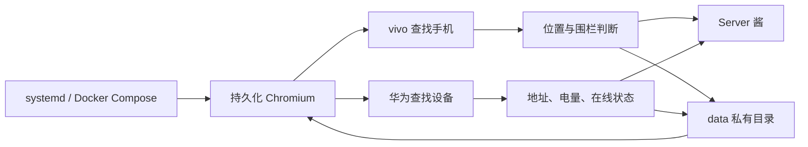

# vivo / 华为“查找设备”位置监控与 Server 酱通知

在 Linux 服务器上运行持久化 Chromium，定时打开 vivo“查找手机”和华为云空间“查找设备”，读取已授权设备的位置状态，并通过 [Server 酱](https://sct.ftqq.com/)发送通知。

本项目适合个人和家庭自用。请只监控自己的设备，或已经得到设备所有者明确授权的设备。

## 功能

### vivo

- 默认每 5 分钟刷新一次定位。
- 判断未移动、移动距离、手机离线或定位未更新。
- 支持多个圆形电子围栏，到达或离开时通知。
- 默认每 30 分钟主动汇报一次当前位置。
- 通知标题格式：`称呼·地址·状态`。
- 登录失效、连续定位异常时通知。
- SQLite 保存最后有效位置和待发送通知，发送失败自动退避重试。

### 华为

- 支持“Contacts/联系人”中的共享设备。
- 按配置时间汇报地址、电量、在线状态和华为更新时间。
- 通知标题格式：`称呼·地址 电量XX%`。
- 默认每 10 分钟刷新页面保活。
- 保存 sessionStorage 与 Cookie，容器重启后尝试恢复会话。
- 登录失效与页面读取失败使用不同标题通知。

### 运行结果


## 工作方式



浏览器以有界面模式运行，但服务器无需安装桌面环境。容器内部使用 Xvfb、x11vnc 和 noVNC；noVNC 仅绑定服务器回环地址，通过 SSH 隧道临时登录。

## 目录

```text
.
├── vivo/                 # vivo 监控、登录脚本、页面适配器
├── huawei/               # 华为监控与登录脚本
├── tests/                # 不含真实位置的基础测试
├── docs/                 # 隐私与故障排查
├── systemd/              # 可选的开机自启单元
├── compose.yaml
├── Dockerfile
└── .env.example
```

## 环境要求

- Linux x86_64 服务器，推荐 2 vCPU、4 GiB 内存。
- Docker Engine 与 Docker Compose v2；也可按 Compose 参数改写为 Podman。
- 能访问 vivo、华为云空间和 Server 酱。
- 一个 Server 酱 SendKey。
- 首次登录时，本地电脑能通过 SSH 连接服务器。

## 快速部署

### 1. 准备配置

```bash
git clone https://github.com/xueze-ai/vivo-huawei-find-device-monitor.git
cd vivo-huawei-find-device-monitor
cp .env.example .env
cp vivo/config.example.json vivo/config.json
mkdir -p data/vivo data/huawei
chmod -R 700 data
```

编辑 `.env`，至少填写：

```dotenv
SERVERCHAN_SENDKEY=SCT_REPLACE_WITH_YOUR_SENDKEY
HUAWEI_DEVICE_NAME=你的设备显示名称
HUAWEI_NOTIFICATION_LABEL=家人B
HUAWEI_REPORT_TIMES=09:30,21:00
```

编辑 `vivo/config.json`：

- `device_id`：网页中的设备标识。
- `share_member_name`：共享联系人名称；本人设备可按页面适配情况留空。
- `notification_prefix`：通知中的称呼。
- `zones`：围栏中心坐标、半径和缓冲区。
- 确认页面选择器后，将 `adapter_verified` 改为 `true`。

配置文件中的坐标系必须和网页返回数据一致。vivo 国内地图常见为 BD-09；请用自己的页面数据核实。

### 2. 构建镜像

```bash
docker compose build
```

### 3. 首次登录 vivo

服务器执行：

```bash
docker compose run --rm --service-ports vivo-monitor login
```

本地电脑建立 SSH 隧道：

```bash
ssh -L 6080:127.0.0.1:6080 user@example-server
```

本地浏览器打开：

```text
http://127.0.0.1:6080/vnc.html?autoconnect=true&resize=scale
```

完成 vivo 登录与网站要求的验证后，在服务器终端按 `Ctrl+C` 结束登录模式。

### 4. 首次登录华为

服务器执行：

```bash
docker compose run --rm --service-ports huawei-monitor login
```

另建隧道：

```bash
ssh -L 6081:127.0.0.1:6081 user@example-server
```

打开：

```text
http://127.0.0.1:6081/vnc.html?autoconnect=true&resize=scale
```

完成华为登录，确认能够看到目标设备后结束登录模式。

### 5. 启动监控

```bash
docker compose up -d
docker compose ps
docker compose logs --tail=100 vivo-monitor
docker compose logs --tail=100 huawei-monitor
```

手动触发一次华为汇报：

```bash
touch data/huawei/run.request
```

## vivo 围栏配置

每个围栏包含：

```json
{
  "name": "示例区域",
  "lat": 31.2304,
  "lon": 121.4737,
  "radius_meters": 500,
  "buffer_meters": 50
}
```

`buffer_meters` 用于减少 GPS 在边界附近波动造成的反复“到达/离开”通知。进入半径以内判定到达；离开时需超过半径加缓冲距离。

## 华为共享设备配置

华为页面语言和共享数量会影响菜单文字。默认值适用于英文页面、一个共享设备：

```dotenv
HUAWEI_CONTACTS_LABEL=Contacts
HUAWEI_SHARING_TEXT=Sharing the location of 1 devices
```

如果页面显示中文或共享设备数量不同，请按页面可见文字修改。`HUAWEI_DEVICE_NAME` 必须和卡片上的设备名称一致。

## 开机自启

修改 [systemd/find-device-monitor.service](systemd/find-device-monitor.service) 中的项目目录后安装：

```bash
sudo cp systemd/find-device-monitor.service /etc/systemd/system/
sudo systemctl daemon-reload
sudo systemctl enable --now find-device-monitor.service
```

## 隐私与安全

精确位置、联系人姓名、登录 Cookie 和 SendKey 都是敏感数据。本仓库只提供占位示例，不应提交生产配置。

- `.env`、`vivo/config.json` 和整个 `data/` 已加入 `.gitignore`。
- noVNC 端口只监听 `127.0.0.1`。
- 不要把密码、验证码、Cookie 或带地址的截图写入 issue。
- 公开仓库前按 [隐私检查清单](docs/PRIVACY.md)逐项检查。

## 已知限制

- vivo 与华为都没有为此用途提供稳定的公开网页 API；网站改版后可能需要调整选择器。
- 手机离线、关机、关闭定位或系统省电时，网页可能只返回旧位置。
- 会话仍可能被网站主动撤销，程序会发送登录失效通知，但无法绕过二次验证。
- 本项目不提供隐蔽跟踪、绕过账号安全或未经授权的设备访问能力。

## 测试

```bash
python -m unittest tests/test_core.py
node tests/test_extract.cjs
python -m py_compile vivo/*.py huawei/*.py
```

## 故障排查

请看 [docs/TROUBLESHOOTING.md](docs/TROUBLESHOOTING.md)。

## 许可证

[MIT License](LICENSE)
